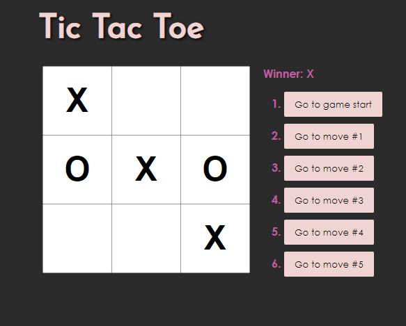

# Tic-Tac-Toe (React Version)

Built during a hackathon with the School of Code, this project was built while learning React functional classes and hooks.

### To start:

```javascript
npm i
npm start
```

#### Dependencies:

- Built only with Create-react-app and no additional dependencies

##### Screenshot


